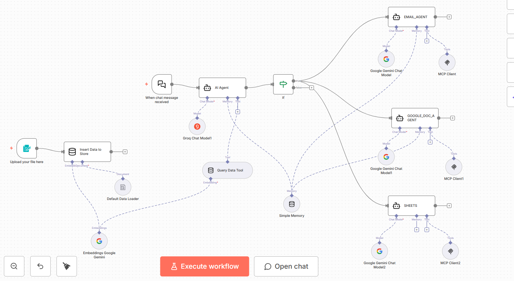
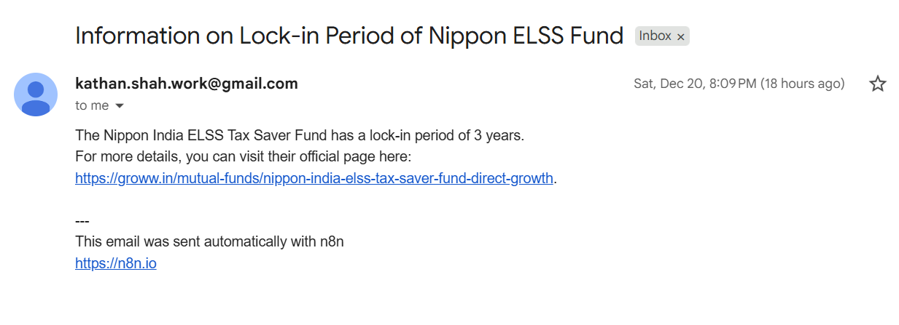
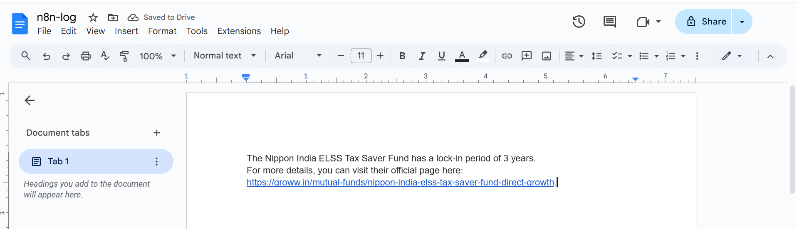

#n8n workflow


--
A complete 3-layer system that scrapes mutual fund data from Groww, processes it through n8n RAG workflow, and provides an intelligent AI assistant that answers questions and performs actions via MCP tools.

---

## 📋 Table of Contents

1. [System Overview](#system-overview)
2. [Layer 1: Local Scraper](#layer-1-local-scraper)
3. [Layer 2: n8n RAG Workflow](#layer-2-n8n-rag-workflow)
4. [Layer 3: Main Orchestrator](#layer-3-main-orchestrator)
5. [Complete Workflow Diagram](#complete-workflow-diagram)
6. [Setup & Usage](#setup--usage)

---

## 🎯 System Overview

This project consists of three interconnected layers:

```
┌─────────────────────────────────────────────────────────────┐
│                    USER INTERACTION                          │
│              (Chat Interface / Questions)                   │
└───────────────────────┬─────────────────────────────────────┘
                        │
                        ▼
┌─────────────────────────────────────────────────────────────┐
│              LAYER 3: MAIN ORCHESTRATOR                      │
│  • AI Agent with RAG capabilities                           │
│  • Asks clarifying questions                                │
│  • Calls MCP tools (Gmail, Google Docs, Sheets)            │
└───────────────────────┬─────────────────────────────────────┘
                        │
                        ▼
┌─────────────────────────────────────────────────────────────┐
│              LAYER 2: N8N RAG WORKFLOW                       │
│  • Uploads scraper JSON data                                │
│  • Creates vector embeddings                                │
│  • Stores in vector database                                │
│  • Retrieves relevant data for queries                      │
└───────────────────────┬─────────────────────────────────────┘
                        │
                        ▼
┌─────────────────────────────────────────────────────────────┐
│              LAYER 1: LOCAL SCRAPER                         │
│  • Scrapes Groww mutual fund pages                          │
│  • Extracts structured data                                │
│  • Saves to JSON files                                      │
└─────────────────────────────────────────────────────────────┘
```

---

## 🔧 Layer 1: Local Scraper

### What It Does

The local scraper extracts structured mutual fund data from Groww website and saves it as JSON files.

### How It Works

#### Step 1: Fetch the Webpage
```
User provides URL → Scraper fetches HTML from Groww
```

**Methods Used:**
- **Playwright** (primary): Handles dynamic JavaScript content
- **Selenium** (fallback): Alternative browser automation
- **Requests** (fallback): Simple HTTP requests if browser automation fails

#### Step 2: Parse HTML Content
```
HTML → BeautifulSoup → Extract structured data
```

**Data Extracted:**
- Fund name, NAV, AUM
- Returns (1Y, 3Y, 5Y, since inception)
- Expense ratio, exit load, tax implications
- Top holdings (top 5, top 10)
- Advanced ratios (PE, PB, Alpha, Beta, Sharpe, Sortino)
- Category information and rankings
- Minimum investment amounts
- Risk level and fund type

#### Step 3: Save to JSON
```
Structured data → JSON file → data/mutual_funds/
```

**File Naming:**
- Extracted from URL slug
- Example: `nippon-india-flexi-cap-fund-direct-growth.json`

### Code Structure

```python
# Main scraper class
GrowwScraper
  ├── fetch_page()           # Gets HTML from URL
  ├── parse_fund_data()      # Extracts structured data
  ├── extract_parameters()   # Parses specific fields
  └── save_json()            # Saves to JSON file

# Batch processing
batch_scrape.py
  ├── load_urls_from_file()  # Reads URLs from urls.txt
  ├── scrape_urls()          # Processes multiple URLs
  └── main()                 # Entry point
```

### Example Usage

```bash
# Scrape single URL
python batch_scrape.py https://groww.in/mutual-funds/nippon-india-flexi-cap-fund-direct-growth

# Scrape from file
python batch_scrape.py --file urls.txt

# Output: data/mutual_funds/nippon-india-flexi-cap-fund-direct-growth.json
```

### Output Format

```json
[
  {
    "fund_name": "Nippon India Flexi Cap Fund Direct Growth",
    "nav": {
      "value": "₹17.82",
      "as_of": "18 Dec 2025"
    },
    "fund_size": "₹9,632.16Cr",
    "returns": {
      "1y": "0.8%",
      "3y": "16.9%",
      "since_inception": "14.2%"
    },
    "cost_and_tax": {
      "expense_ratio": "0.46%",
      "exit_load": "Exit load for units in excess of 10%...",
      "tax_implication": "..."
    },
    "top_5_holdings": [...],
    "source_url": "https://groww.in/mutual-funds/...",
    "last_scraped": "2025-12-19"
  }
]
```

---

## 🔄 Layer 2: n8n RAG Workflow

### What It Does

The n8n workflow takes the scraper JSON files, processes them for RAG (Retrieval-Augmented Generation), and makes the data searchable for the AI agent.

### How It Works

#### Step 1: Upload Scraper Data
```
JSON file → Form Trigger → n8n Workflow
```

**Process:**
1. User uploads JSON file(s) via n8n form interface
2. Form Trigger receives the file(s)
3. Data is passed to the processing pipeline

#### Step 2: Load and Process Data
```
Form Trigger → Default Data Loader → Embeddings → Vector Store
```

**Components:**
- **Default Data Loader**: Parses JSON and extracts text content
- **Embeddings Google Gemini**: Converts text to vector embeddings
- **Vector Store (Insert Mode)**: Stores embeddings in memory for retrieval

#### Step 3: Query Data (When User Asks Questions)
```
Chat Trigger → AI Agent → Query Data Tool → Vector Store
```

**Flow:**
1. User sends chat message
2. Chat Trigger receives the message
3. AI Agent processes the query
4. Query Data Tool searches vector store for relevant information
5. Retrieved data is sent back to AI Agent
6. AI Agent generates response using retrieved context

### n8n Workflow Structure

```
┌─────────────────────────────────────────────────────────────┐
│                    DATA LOADING FLOW                        │
└─────────────────────────────────────────────────────────────┘

┌──────────────┐     ┌──────────────┐     ┌──────────────┐
│ Form Trigger │───► │ Data Loader  │───► │ Vector Store │
│ (Upload)     │     │ (Parse JSON) │     │ (Insert)     │
└──────────────┘     └──────┬───────┘     └──────────────┘
                            │
                            ▼
                     ┌──────────────┐
                     │ Embeddings   │
                     │ (Gemini)     │
                     └──────────────┘

┌─────────────────────────────────────────────────────────────┐
│                    QUERY FLOW                               │
└─────────────────────────────────────────────────────────────┘

┌──────────────────┐
│ Chat Trigger     │ (User question)
└────────┬─────────┘
         │
         ▼
┌──────────────────┐     ┌──────────────┐     ┌──────────────┐
│ AI Agent         │◄────│ Query Tool   │◄────│ Vector Store │
│ (Groq/Kimi)      │     │ (Search)     │     │ (Retrieve)   │
└────────┬─────────┘     └──────────────┘     └──────────────┘
         │
         ▼
    ┌──────────┐
    │ If Node   │ (Route based on output)
    └────┬─────┘
         │
         ├───► EMAIL_AGENT ──► MCP Client (Gmail)
         ├───► GOOGLE_DOC_AGENT ──► MCP Client (Docs)
         └───► SHEETS_AGENT ──► MCP Client (Sheets)
```

### Key Components

**1. Form Trigger** (`formTrigger`)
- Receives uploaded JSON files
- Entry point for data ingestion

**2. Default Data Loader** (`documentDefaultDataLoader`)
- Parses JSON files
- Extracts text content for embedding

**3. Embeddings** (`embeddingsGoogleGemini`)
- Converts text to vector representations
- Used for both insertion and retrieval

**4. Vector Store** (`vectorStoreInMemory`)
- **Insert Mode**: Stores embeddings when data is uploaded
- **Retrieve Mode**: Searches for relevant data when queried

**5. Chat Trigger** (`chatTrigger`)
- Receives user questions
- Initiates query flow

**6. AI Agent** (`agent`)
- Main orchestrator for answering questions
- Uses Groq/Kimi model
- Decides when to use tools

**7. Query Data Tool** (`vectorStoreInMemory` in retrieve mode)
- Searches vector database
- Returns relevant mutual fund information

---

## 🎭 Layer 3: Main Orchestrator

### What It Does

The main orchestrator is an AI agent that:
1. Understands user queries about mutual funds
2. Asks clarifying questions when needed
3. Retrieves relevant data from the RAG system
4. Calls MCP tools (Gmail, Google Docs, Sheets) when requested

### How It Works

#### Step 1: Receive User Query
```
User Question → Chat Trigger → AI Agent
```

#### Step 2: Classify Query
The AI Agent evaluates the query and classifies it into one of four categories:

**1. OUT_OF_DOMAIN**
- Query is not about mutual funds
- Response: Brief description + 3 example questions

**2. IN_DOMAIN_INCOMPLETE**
- Query is about mutual funds but missing required context
- Response: 1-2 precise clarifying questions

**3. IN_DOMAIN_COMPLETE**
- Query is about mutual funds with sufficient context
- Action: Use Query Data Tool to retrieve information
- Response: Factual answer with citation link
- Follow-up: "Do you want this sent to your email?"

**4. TOOL_CALL**
- User wants to send email or update documents
- Action: Route to appropriate agent (EMAIL_AGENT, GOOGLE_DOC_AGENT, SHEETS_AGENT)

#### Step 3: Retrieve Data (If IN_DOMAIN_COMPLETE)
```
AI Agent → Query Data Tool → Vector Store → Relevant Data → AI Agent
```

**Process:**
1. AI Agent determines it needs data
2. Calls Query Data Tool with user query
3. Query Data Tool searches vector store
4. Returns relevant mutual fund information
5. AI Agent combines retrieved data with conversation context
6. Generates factual response

#### Step 4: Route to Tools (If TOOL_CALL)
```
AI Agent → If Node → Route to specific agent → MCP Client → External Tool
```

**Routing Logic:**
- **TOOL_EMAIL**: Routes to EMAIL_AGENT
- **TOOL_DOC**: Routes to GOOGLE_DOC_AGENT
- **TOOL_SHEETS**: Routes to SHEETS_AGENT

**MCP Tools Available:**
1. **Gmail Tool**: Send emails with agent response


2. **Google Docs Tool**: Update Google Docs with content


3. **Google Sheets Tool**: Log interactions in spreadsheet

### Decision Flow

```
                    User Query
                         │
                         ▼
              ┌──────────────────────┐
              │   AI Agent Evaluates │
              └──────────┬───────────┘
                         │
        ┌────────────────┼────────────────┐
        │                │                │
        ▼                ▼                ▼
   OUT_OF_DOMAIN  INCOMPLETE      COMPLETE/TOOL
        │                │                │
        │                │                │
   Show examples    Ask questions    ┌────┴────┐
                                    │         │
                                    ▼         ▼
                              COMPLETE    TOOL_CALL
                                    │         │
                                    │         │
                          Query Data Tool   Route to Agent
                                    │         │
                                    │         │
                          Generate Response  Call MCP Tool
```

### Example Interactions

#### Example 1: Complete Query
```
User: "What is the expense ratio of Nippon India Flexi Cap Fund?"

AI Agent:
1. Classifies as IN_DOMAIN_COMPLETE
2. Calls Query Data Tool
3. Retrieves: expense_ratio: "0.46%"
4. Responds: "The expense ratio of Nippon India Flexi Cap Fund Direct Growth is 0.46% (effective from 18 Dec 2025). [Citation link]"
5. Asks: "Do you want this sent to your email? If yes, please provide your email ID."
```

#### Example 2: Incomplete Query
```
User: "What is the exit load?"

AI Agent:
1. Classifies as IN_DOMAIN_INCOMPLETE
2. Responds: "1. Which mutual fund are you asking about?"
            "2. Are you asking about a specific fund or category?"
```

#### Example 3: Tool Call
```
User: "Send this to my email: user@example.com"

AI Agent:
1. Classifies as TOOL_CALL
2. Routes to EMAIL_AGENT
3. EMAIL_AGENT calls MCP Client (Gmail)
4. Email sent with previous agent response
```

#### Example 4: Out of Domain
```
User: "What's the weather today?"

AI Agent:
1. Classifies as OUT_OF_DOMAIN
2. Responds: "I'm a mutual fund facts-only assistant. I can help with:
            - ELSS lock-in period and exit load
            - Brokerage or DP charges
            - SIP mandates and fees
            - Fund categories, NAV, expense ratio, taxation
            
            Example questions:
            1. What is the expense ratio of Nippon India Flexi Cap Fund?
            2. What is the exit load for ELSS funds?
            3. What are the top holdings of SBI Large Cap Fund?"
```

### Safety Rules

The AI Agent follows strict safety rules:
- ✅ Provides factual information only
- ✅ No investment advice, opinions, or predictions
- ✅ Does NOT ask for or store PII (contact details, PAN, bank details, investment amounts)
- ✅ Reminds users not to share personal information
- ✅ Bases answers strictly on retrieved data

---

## 🔄 Complete Workflow Diagram

```
┌─────────────────────────────────────────────────────────────────────────┐
│                         COMPLETE SYSTEM FLOW                            │
└─────────────────────────────────────────────────────────────────────────┘

LAYER 1: DATA COLLECTION
─────────────────────────
┌──────────────┐
│  Groww Site  │
└──────┬───────┘
       │
       │ Scrape
       ▼
┌──────────────┐     ┌──────────────┐     ┌──────────────┐
│   Scraper    │───► │ Parse HTML   │───► │ Save JSON    │
│ (Playwright) │     │ (BeautifulSoup)│     │ (data/mutual_funds/)│
└──────────────┘     └──────────────┘     └──────────────┘

LAYER 2: DATA PROCESSING
─────────────────────────
┌──────────────┐
│  JSON Files  │
└──────┬───────┘
       │
       │ Upload via Form
       ▼
┌──────────────┐     ┌──────────────┐     ┌──────────────┐
│ Form Trigger │───► │ Data Loader  │───► │ Embeddings   │
└──────────────┘     └──────────────┘     └──────┬───────┘
                                                  │
                                                  ▼
                                         ┌──────────────┐
                                         │ Vector Store │
                                         │ (Insert)     │
                                         └──────────────┘

LAYER 3: USER INTERACTION
──────────────────────────
┌──────────────┐
│ User Query   │
└──────┬───────┘
       │
       ▼
┌──────────────┐
│ Chat Trigger │
└──────┬───────┘
       │
       ▼
┌──────────────┐
│  AI Agent    │ (Evaluates query)
└──────┬───────┘
       │
       ├─── OUT_OF_DOMAIN ──► Show examples
       │
       ├─── INCOMPLETE ──► Ask clarifying questions
       │
       ├─── COMPLETE ──► Query Data Tool ──► Vector Store ──► Generate Response
       │                                          │
       │                                          ▼
       │                                   ┌──────────────┐
       │                                   │ Retrieve     │
       │                                   │ Relevant Data│
       │                                   └──────────────┘
       │
       └─── TOOL_CALL ──► If Node ──► Route to Agent ──► MCP Client ──► Tool
                                                              │
                                                              ├──► Gmail
                                                              ├──► Google Docs
                                                              └──► Google Sheets
```

---

## 🚀 Setup & Usage

### Prerequisites

1. **Python 3.8+**
2. **n8n instance** (cloud or self-hosted)
3. **Google API credentials** (for Gmail, Docs, Sheets)
4. **Groq API key** (for AI model)

### Installation

#### 1. Install Python Dependencies

```bash
pip install -r requirements.txt
playwright install chromium
```

#### 2. Setup n8n Workflows

1. Import `n8n/RAG-workflow.json` into n8n
2. Import `n8n/MCP server.json` into n8n
3. Configure credentials:
   - Google OAuth2 (Gmail, Docs, Sheets)
   - Groq API
   - Google Gemini API (for embeddings)

#### 3. Configure URLs

Edit `urls.txt` with mutual fund URLs:
```
https://groww.in/mutual-funds/nippon-india-flexi-cap-fund-direct-growth
https://groww.in/mutual-funds/nippon-india-large-cap-fund-direct-growth
```

### Usage Flow

#### Step 1: Scrape Data (Layer 1)

```bash
# Scrape mutual fund data
python batch_scrape.py --file urls.txt

# Output: JSON files in data/mutual_funds/
```

#### Step 2: Upload to n8n (Layer 2)

1. Open n8n RAG workflow
2. Click "Execute Workflow" or use form trigger
3. Upload JSON file(s) from `data/mutual_funds/`
4. Data is processed and stored in vector database

#### Step 3: Query via Chat (Layer 3)

1. Open n8n chat interface
2. Ask questions about mutual funds
3. AI agent retrieves data and responds
4. Optionally request email/document updates

### Example Workflow

```bash
# 1. Scrape data
python batch_scrape.py --file urls.txt

# 2. Upload to n8n (via web interface)
# - Go to n8n RAG workflow
# - Upload JSON files

# 3. Chat with AI
# User: "What is the expense ratio of Nippon India Flexi Cap Fund?"
# AI: "The expense ratio is 0.46%..."
# AI: "Do you want this sent to your email?"

# User: "Yes, send to user@example.com"
# AI: [Sends email via Gmail tool]
```

---

## 📁 Project Structure

```
scrapper/
├── groww_scraper.py          # Core scraper class
├── batch_scrape.py            # Batch scraping script
├── urls.txt                   # URLs to scrape
├── requirements.txt          # Python dependencies
├── README.md                  # This file
├── data/
│   ├── mutual_funds/         # Scraped JSON files
│   └── downloaded_html/      # Temporary HTML files
└── n8n/
    ├── RAG-workflow.json     # RAG processing workflow
    ├── MCP server.json       # MCP tools workflow
    └── ARCHITECTURE.txt      # n8n architecture details
```

---

## 🔑 Key Features

### Layer 1 (Scraper)
- ✅ Handles dynamic JavaScript content
- ✅ Extracts comprehensive fund data
- ✅ Batch processing support
- ✅ Structured JSON output

### Layer 2 (n8n RAG)
- ✅ Vector embeddings for semantic search
- ✅ In-memory vector store
- ✅ Automatic data processing
- ✅ Query-based retrieval

### Layer 3 (Orchestrator)
- ✅ Intelligent query classification
- ✅ Clarifying questions for incomplete queries
- ✅ Factual responses with citations
- ✅ MCP tool integration (Gmail, Docs, Sheets)
- ✅ Safety rules (no PII, no advice)

---

## 📝 Notes

- The scraper uses Playwright/Selenium for dynamic content
- Vector store is in-memory (resets on n8n restart)
- AI agent uses Groq/Kimi model for fast responses
- All responses are factual only (no investment advice)
- MCP tools require proper OAuth2 setup

---

## 🤝 Contributing

This is a personal project. For questions or issues, refer to the code comments in the respective files.

---

## 📄 License

This project is provided as-is for educational and personal use.
